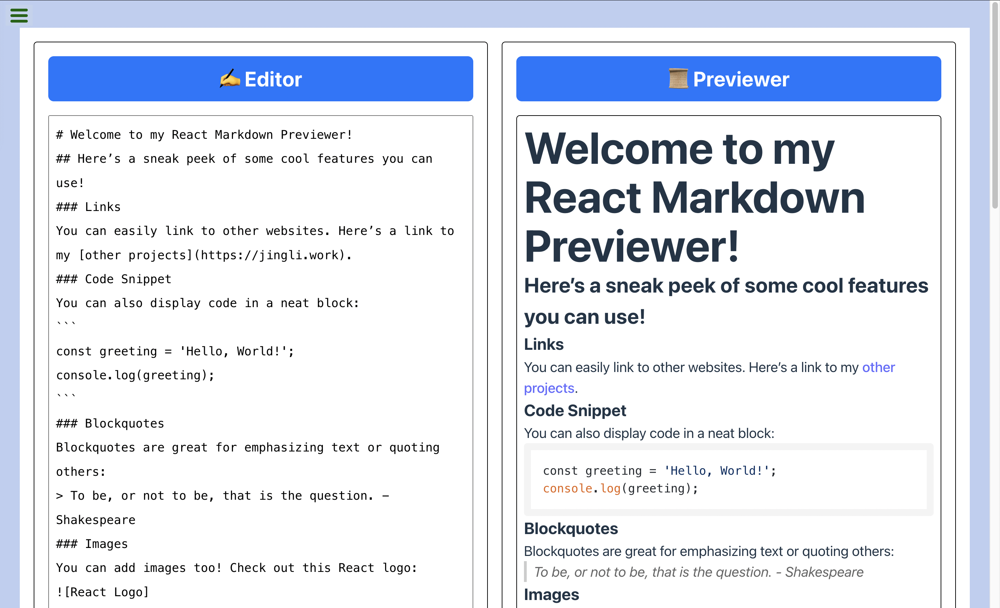
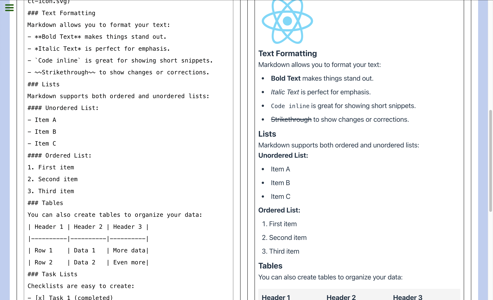
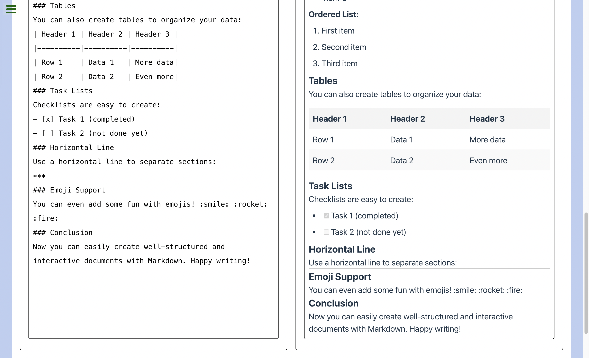

# 📝 Markdown Previewer

An interactive Markdown editor and previewer, developed with React and SASS. This tool allows users to write Markdown syntax in real-time and see the rendered preview.


## Features

- **Live Preview**: Instant rendering of Markdown text
- **Syntax Highlighting**: Code blocks are highlighted with `highlight.js`
- **Responsive Design**: Works on all screen sizes
- **Sanitized Output**: Security through `DOMPurify`
- **Line Breaks**: Correct interpretation of multiple line breaks

## Technologies

- **Frontend Framework**: React 17
- **Styling**: SASS (with nested syntax)
- **Markdown Conversion**: Marked
- **Code Highlighting**: highlight.js
- **Security**: DOMPurify
- **Build Tool**: Vite

## Technical Challenges

The biggest challenge in this project was handling multiple line breaks in the textarea that needed to be correctly displayed as line breaks in the previewer. This was solved through a special regex replacement:

```javascript
marked(markdown.replace(/\n(?=\n)/g, "\n<br>\n"))
```

This solution enables the Markdown previewer to interpret line breaks and render them as `<br>` elements, which provides an improved user experience.

## Preview

<div align="center">
  
  <p><em>Main view of the Markdown Previewer</em></p>
  
  
  <p><em>Text Styling, Lists and Tables</em></p>
  
  
  <p><em>Responsive Design for various screen sizes</em></p>
</div>

## Project Structure

```
markdown-previewer/
├── src/
│   ├── components/
│   │   ├── Editor.jsx       # Textarea component for Markdown input
│   │   └── Previewer.jsx    # Preview component with Marked integration
│   ├── App.jsx              # Main component
│   ├── App.scss             # Main styling file
│   ├── AppContextProvider.jsx # Context for state management
│   ├── _index.scss          # Base styling
│   └── main.jsx             # Application entry point
├── public/
└── ...configuration files
```

Try it out - It's fun!